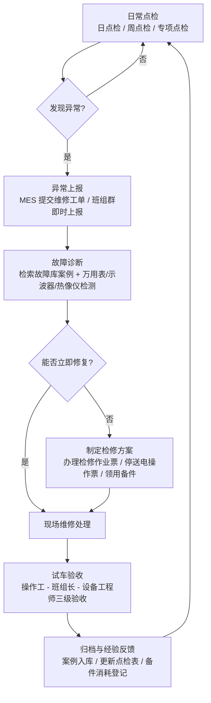

# Electrical-Equipment-Maintenance-Simulation（工厂电气设备全流程维护与故障模拟）

> 一套面向离散制造工厂的电气设备维保体系完整模拟项目：**点检标准化 → 保养计划化 → 故障案例化 → 应急程序化 → 备件数据化 → 培训体系化 → 制度文件化**。

---

## 一、项目简介

本项目模拟一家中型制造工厂（约 300 台/套电气设备，涵盖高低压配电柜、三相异步电机、变频器、PLC 控制柜、伺服驱动系统、现场传感器与工业通讯网络）的电气设备全流程维护体系。项目借鉴核电行业成熟的**预防性维修（PM）、两票三制、经验反馈（OPEX）、纵深防御**等管理思想，将工厂电气维保工作拆解为可执行、可量化、可追溯的模块：日/周点检标准、年度保养计划、50 个典型故障案例库、电机烧毁应急演练方案、备件安全库存管理、新员工电气安全培训，以及四份基础管理制度汇编。

传统的工厂电气维保普遍存在"三无"问题：**点检无标准**（凭老师傅经验，看不懂什么叫"正常"）、**故障无沉淀**（同一个故障反复发生，每次都从头排查）、**应急无程序**（出事靠吼、抢修靠抢、复盘靠忘）。本项目的目标就是把这三块短板逐一补齐：

1. **点检有标准**——每台设备的每个检查项都有明确量化阈值（如电机三相电流不平衡度 ≤10%、PLC 柜温 ≤40℃、接地电阻 ≤4Ω），新员工照表即可点检；
2. **故障有沉淀**——50 个高频故障按"现象→排查步骤→根本原因→处理方案→预防措施"五段式入库，重复故障一键检索、平均修复时间（MTTR）大幅缩短；
3. **应急有程序**——从报警、抢修、备件调用到复盘报告，全流程脚本化，演练有本可依。

### 核心业务流程

维保业务主流程为：**点检 → 异常上报 → 故障诊断 → 维修 → 验收归档**，形成闭环管理：



> 备件管理贯穿维修环节：备件出库后库存低于安全线自动触发采购补货，详见《备件管理/备件安全库存表.md》。

## 二、技术栈

| 类别 | 工具 | 用途 |
|---|---|---|
| 数据管理 | **Excel** | 设备台账、日/周点检记录、备件库存台账、MTTR/MTBF 月度统计 |
| 文档管理 | **Word** | 制度文件、检修作业票/停送电操作票票样、应急演练方案、培训教材 |
| 工单系统 | **MES** | 异常上报、维修工单流转与关闭、验收闭环、设备 OEE 数据采集 |
| 流程建模 | **Mermaid** | 维保业务流程图、应急演练处置流程图、备件调用流程图 |
| 检测仪表 | 万用表 / 兆欧表 / 钳形电流表 / 红外热像仪 / 振动笔 | 点检量化判定与故障诊断 |
| 版本管理 | Git + GitHub | 体系文件版本控制、故障案例库持续沉淀与经验反馈 |

## 三、目录结构

```text
Electrical-Equipment-Maintenance-Simulation/
├── README.md                        # 项目简介（本文件）
├── 点检标准/
│   ├── 日点检表.md                  # 5 大类设备日点检项目与正常范围
│   └── 周点检表.md                  # 接地/绝缘/清洁/紧固等 12 项周检
├── 保养计划/
│   └── 年度保养计划.md              # 1-12 月任务分配 + 春检/秋检 + 预防性更换周期表
├── 故障库/
│   └── 50个故障案例库.md            # 电机/PLC/伺服/通讯/传感器 五类 50 例
├── 应急演练/
│   └── 电机烧毁应急演练方案.md      # 报警-抢修-备件调用-复盘 全脚本
├── 备件管理/
│   └── 备件安全库存表.md            # 27 项备件安全库存与采购信息
├── 培训材料/
│   └── 新员工电气安全培训大纲.md    # 4 课时 PPT 逐页要点
├── 制度文件/
│   └── 电气设备管理制度汇编.md      # 台账/检修票/操作票/外来施工 四制度
└── resume/
    └── 项目总结.md                  # 第一人称项目复盘总结
```

## 四、关键维保指标（KPI）

| 指标 | 定义 | 目标值 |
|---|---|---|
| 点检执行率 | 实际点检班次 / 计划点检班次 | ≥ 95% |
| MTTR | 平均故障修复时间 | ≤ 2 h |
| MTBF | 平均无故障运行时间 | ≥ 720 h |
| 故障重复率 | 30 天内同一设备同一故障再发比例 | ≤ 3% |
| 备件满足率 | 维修领用时备件可用比例 | ≥ 98% |
| 演练完成率 | 年度应急演练计划完成比例 | 100% |

## 五、使用方法

1. 新工厂/新车间投运时，先用《设备台账管理制度》建立台账，再按设备类型套用《日点检表》《周点检表》模板；
2. 按《年度保养计划》排定全年保养与预防性更换任务，录入 MES 生成周期性工单；
3. 每次故障处理后，按五段式格式将案例追加进《故障案例库》，并回头修订点检表与保养周期；
4. 每半年按《电机烧毁应急演练方案》组织一次实战演练，用复盘报告模板闭环；
5. 按《备件安全库存表》执行"低于安全线即补货"，按培训大纲完成新员工取证上岗。

## 六、声明

本项目为**模拟教学/求职作品集用途**，文件中的设备型号、供应商、数量均为示例数据，实际使用时请结合本厂设备实际与国家/行业现行标准（GB 26860《电力安全工作规程 发电厂和变电站电气部分》、GB 50054《低压配电设计规范》等）进行校核修订。
