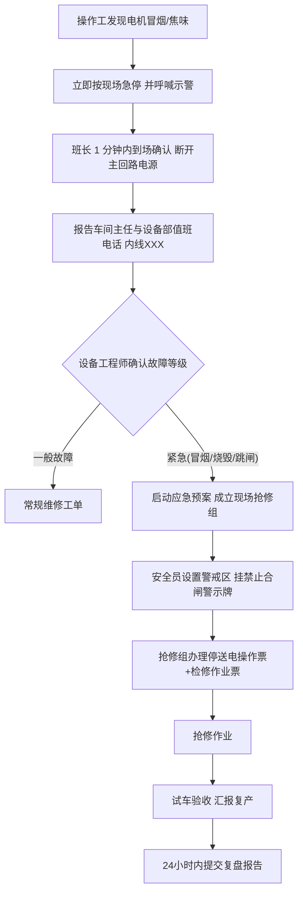

# 电机烧毁应急演练方案

> **演练名称**：车间主输送线驱动电机烧毁应急演练（实战型桌面+现场综合演练）
> **演练目的**：检验《电气设备应急预案》的可操作性，锻炼运行发现、报警上报、倒闸隔离、抢修更换、备件调用、验收复产、复盘改进的全流程协同能力，确保真实事故下 MTTR 控制在 2 小时以内。

---

## 一、演练基本信息

| 项目 | 内容 |
|---|---|
| 演练时间 | 202X 年 X 月 X 日 14:00—16:30（含复盘会） |
| 演练地点 | 二车间主输送线 3# 驱动站 + 备件库 + 设备部会议室 |
| 演练形式 | 现场实战演练（真机停电操作，模拟故障卡件，不真烧电机） |
| 演练场景 | 3# 输送线主驱动电机（YE3-132M-4，7.5kW）运行中冒烟、焦味并跳闸，确认绕组烧毁，需紧急更换 |
| 参演人数 | 13 人（分组见下） |

## 二、组织机构与职责

| 角色 | 人数 | 职责 |
|---|---|---|
| 演练总指挥（设备部长） | 1 | 宣布演练开始/结束，总体决策，讲评 |
| 现场指挥（设备工程师） | 1 | 现场处置指挥、技术方案把关、进度控制 |
| 运行发现组（操作工+班长） | 3 | 发现异常、报警上报、执行停机与现场警戒 |
| 电气抢修组（电工 2 人+监护人） | 3 | 倒闸停电、验电挂牌、故障确认、更换电机、试车 |
| 备件保障组（库管员+采购） | 2 | 备件出库、送达现场、补货触发 |
| 安全监督组（安全员） | 1 | 全程安全监护，纠正违章，记录评估 |
| 记录评估组 | 2 | 时间节点记录、影像留存、打分 |

## 三、报警流程（发现→确认→上报→启动）



**报警要求**：口头报警必须包含"四要素"——**时间、地点（设备编号）、现象（冒烟/跳闸）、是否伤人**；紧急情况下先处置后补单，但必须在处置完成后 30 分钟内在 MES 补录工单。

## 四、演练脚本（时间轴）

| 时间 | 情景注入 | 处置动作（口令） | 责任人 |
|---|---|---|---|
| 14:00 | 总指挥宣布演练开始 | 各组到位，记录组开始计时 | 总指挥 |
| 14:05 | 教员在 3# 电机处施放模拟烟雾 | 操作工发现"冒烟、焦味"，立即拍急停，呼喊"3# 电机冒烟了！" | 操作工 |
| 14:07 | — | 班长到场确认，断开主回路断路器，挂"禁止合闸、有人工作"警示牌 | 班长 |
| 14:08 | — | 班长电话上报设备部（报四要素） | 班长 |
| 14:12 | — | 设备工程师到场判级为紧急，启动预案，成立抢修组 | 现场指挥 |
| 14:15 | — | 安全员拉警戒带；抢修组办理停送电操作票、检修作业票 | 安全员/抢修组 |
| 14:20 | — | 倒闸操作：按操作票断开回路电源→验电（合格验电器，逐相验电）→放电→挂接地线（先接接地端，后接导体端）→挂牌上锁 | 抢修组（一人操作一人监护） |
| 14:30 | — | 拆开接线盒：拍照留档线号→测绝缘确认烧毁（模拟卡件判定"绕组对地 0MΩ"）→ 报告"确认电机烧毁，申请备件" | 抢修组 |
| 14:35 | — | 备件保障组接领料单，出库同型号电机 YE3-132M-4，10 分钟内送达现场；库管核查库存低于安全线，触发采购补货流程 | 备件组 |
| 14:45 | — | 拆除旧电机（标记地脚垫片），新电机就位、找正（同轴度 ≤0.05mm）、接线（力矩紧固+拍照核对）、测绝缘 ≥1MΩ、接地连接 | 抢修组 |
| 15:20 | — | 撤除接地线→清点工具人员→拆牌解锁→送电（倒闸操作票反向执行）→空载点动试车→带载试运行 15 分钟（测温、测电流、听音） | 抢修组 |
| 15:45 | — | 三级验收：操作工确认功能→班长确认工艺→工程师确认数据，MES 关单 | 三方 |
| 15:55 | — | 总指挥宣布演练结束，现场恢复清理 | 总指挥 |
| 16:00 | — | 复盘会（会议室），按模板讲评 | 全体 |

## 五、抢修步骤标准（作业要点）

1. **停电隔离**：按操作票断开上一级电源（不能只断本柜），严格执行"停电→验电→放电→挂牌上锁"四步；
2. **验电**：使用与电压等级相符、在试验有效期内且试验合格的验电器，逐相验电，验电前先在带电体上确认验电器良好；
3. **故障确认**：接线盒端子拍照→拆线并做线号标记→兆欧表摇测绕组对地/相间→判定烧毁（绝缘 <0.5MΩ 或明显短路）并留存数据；
4. **更换作业**：旧电机拆前标记地脚垫片数量方位；新电机安装后联轴器找正；接线按规定力矩紧固并做防松标记；接地扁铁/PE 线必须先接；
5. **复电试车**：撤接地线→清点人员工具→拆牌→送电→空载点动（确认转向）→空载 5 分钟→带载 15 分钟，每 5 分钟记录温度/电流/振动；
6. **验收归档**：三级验收签字，MES 关单，故障数据、照片、更换件录入台账，24 小时内提交复盘报告。

## 六、备件调用流程

1. 抢修组开具《紧急领料单》→ 现场指挥签字确认；
2. 库管员按"紧急抢修绿色通道"**先发货、后补手续**（2 小时内补办出库单）；
3. 出库后库管员核对台账：库存 **低于安全库存线立即触发补货**（本例：7.5kW 电机安全线 1 台，出库后为 0 → 当即在采购系统下单，采购周期 30 天）；
4. 无库存时启动紧急采购：联系供应商调货/兄弟工厂调拨，同时评估同型号替代方案（功率、机座号、轴径兼容性）；
5. 备件费用月度汇总计入设备维修成本，纳入复盘分析。

## 七、安全注意事项（红线）

- 严禁约时停送电；严禁不验电就作业；**谁挂牌、谁摘牌**，一人一锁一钥匙；
- 高处更换电机（>2m）须办高处作业票、系安全带、戴安全帽；
- 搬运电机使用吊装带/液压搬运车，严禁徒手抬 50kg 以上电机；
- 灭火器就近配置（电气火灾用干粉/CO₂，**严禁用水**）；烟气环境先通风后进入；
- 演练全程由安全员监督，出现真实突发情况立即终止演练转入真实处置。

## 八、演练评估标准（100 分）

| 项目 | 分值 | 评分要点 |
|---|---|---|
| 报警上报 | 15 | 四要素齐全、1 分钟内上报、信息准确 |
| 停电隔离 | 20 | 操作票规范、验电到位、挂牌上锁正确 |
| 抢修质量 | 25 | 判故准确、更换工艺达标（找正/力矩/绝缘）、一次试车成功 |
| 备件保障 | 10 | 到位时间 ≤10 分钟、补货流程触发 |
| 恢复验收 | 10 | 试车数据完整、三级验收签字、MES 闭环 |
| 安全与协同 | 15 | 无违章、警戒到位、指挥顺畅 |
| 时间指标 | 5 | MTTR ≤ 120 分钟得满分，每超 10 分钟扣 1 分 |

**结论分级**：≥90 分成功；75～89 分基本成功（需整改）；<75 分为不成功，一个月内重新演练。

## 九、复盘报告模板

```text
============= 电机烧毁应急演练复盘报告 =============
报告编号：YL-202X-XX　　　演练日期：____　　编写人：____

一、演练概况
  演练场景：____________　参演人数：__　总历时：__min（MTTR：__min）
  演练结论：□成功 □基本成功 □不成功（得分：__）

二、时间线记录
  发现 __:__ → 上报 __:__ → 停电挂牌 __:__ → 判故 __:__
  → 备件到场 __:__ → 更换完成 __:__ → 试车开始 __:__ → 验收 __:__

三、亮点（做得好的 3 条）
  1.
  2.
  3.

四、问题与不足（对照评估表逐条）
  | 序号 | 问题描述 | 原因分析 | 整改措施 | 责任人 | 完成期限 |
  |  1   |          |          |          |        |          |

五、预案与资源改进
  □ 预案条款修订：第__条，修订为：____________
  □ 备件调整：建议增储 ______________（现库存__/安全线__）
  □ 工具/仪表补充：____________
  □ 培训需求：____________

六、经验反馈
  本次案例是否入库故障库：□是（案例编号：____）□否
  是否需要修订点检表/保养计划：□是（具体：______）□否

七、签审
  编写：____　现场指挥：____　安全员：____　总指挥批准：____
======================================================
```

> **演练频率要求**：本演练（电机烧毁场景）每半年不少于 1 次，全年应急演练不少于 2 次——上半年按本方案组织实战演练，下半年结合秋检按《电气设备应急预案》选定第二种场景（如全厂失电、变压器故障）组织演练；每次真实电机烧毁事故后 30 天内必须组织针对性复演。
